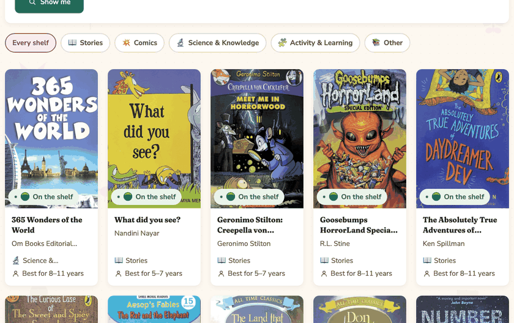
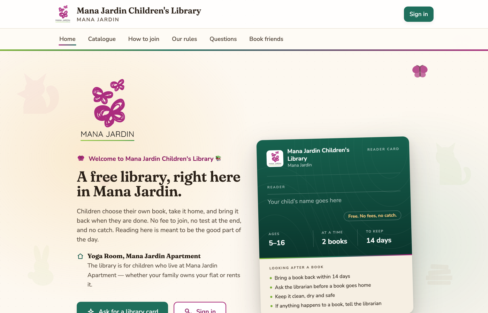

# Community Children's Library Platform

A small, free library management system for a residential community's children's
library. Built for readers aged 5 to 16, run by volunteers, and designed so
the children themselves can eventually operate it.



*The catalogue is readable without signing in; borrowing still needs a card.*



**First deployment:** [Mana Jardin Children's Library](https://library.msrx.co.in) — live, with real readers.

**Status:** in service. Phases 0–5 built the foundation — identity, guardian
verification, catalogue, circulation, reminders and renewal requests, and a
settings, branding and audit screen so the library can be configured without
touching the database ([`docs/PHASE-5.md`](docs/PHASE-5.md)).

Everything since is tracked as decisions rather than phases, because the work
stopped arriving in tidy blocks: a public catalogue with moderated star ratings
from readers, a public donor register, visiting times and a notice board,
account lifecycle for readers who grow up or leave, reader-proposed profile
changes, reports and exports for the desk, an AI book helper that answers only
about books the library owns, and retention machinery that erases fields rather
than rows. See [`docs/ARCHITECTURE_DECISIONS.md`](docs/ARCHITECTURE_DECISIONS.md).

68 architecture decisions · 18 migrations · 35 models · 46 pages · 1,652 tests.

---

## What this is

- **Free.** No membership fee, no borrowing fee, no fines. There is no payment
  code anywhere in this repository and there never will be.
- **Voluntary.** Donating books is never a condition of joining or borrowing.
- **Private.** Children's data is minimised, guardian contact details sit behind
  a permission, and no child can see another child's anything. There is no
  analytics, no tracking, and no third-party script on any page.
- **Reusable.** Nothing about any one community is compiled in. Names, logo,
  colours, age range, loan period and ID prefixes all live in one configuration
  row. A lint rule enforces it.

## Quick start

```bash
git clone <repository-url> && cd community-library
nvm use                 # Node 24 (see .nvmrc)
npm install
cp .env.example .env    # then fill in DATABASE_URL, DIRECT_URL and AUTH_SECRET
npm run db:deploy       # apply migrations
npm run db:seed:demo    # configuration + demo data (DEVELOPMENT ONLY)
npm run dev
```

Open <http://localhost:3000>. Demo sign-ins are printed by the seed.

For a real deployment, seed **without** `:demo` and create the first
administrator interactively:

```bash
npm run db:seed
npm run create-admin
```

Full instructions: [`docs/SETUP.md`](docs/SETUP.md) and
[`docs/DEPLOYMENT.md`](docs/DEPLOYMENT.md).

### Local work never talks to production

`.env` is the whole local environment — development server, build and tests all
run from it, and nothing else on disk is read. Production configuration lives in
Vercel, and a copy pulled for a one-off command goes under
`.env.vercel-production`, a name Next.js never loads.

The name is the point. `next build` sets `NODE_ENV=production`, so Next.js reads
`.env.production.local` ahead of `.env` — a forgotten pull file is enough to
make an ordinary local build query the production database. `npm run build` now
refuses to start when a production-only env file is present. See
[`docs/ENVIRONMENT_VARIABLES.md`](docs/ENVIRONMENT_VARIABLES.md#which-file-a-command-reads).

## Commands

| Command | What it does |
|---|---|
| `npm run dev` | Development server |
| `npm run build` | Production build (generates Prisma client first; refuses if a production `.env` file is lying about) |
| `npm run verify` | Typecheck + lint + unit tests — run before pushing |
| `npm test` | Unit tests (no database needed) |
| `npm run test:db` | Database tests (needs `TEST_DATABASE_URL`) |
| `npm run test:all` | Both suites |
| `npm run db:migrate` | Create and apply a migration in development |
| `npm run db:deploy` | Apply existing migrations (production) |
| `npm run db:seed` | Permissions, roles, library configuration — safe anywhere |
| `npm run db:seed:demo` | The above plus fake people and books — **development only** |
| `npm run create-admin` | Create a Super Admin, password typed and never echoed |

While developing, `EMAIL_PROVIDER=console` captures every message to `.mail/`
and serves it at `/dev/mail` — the whole join → approve → activate flow can be
walked without sending a single real email. That route 404s in production.

## Architecture in one paragraph

A modular monolith on Next.js (App Router) with PostgreSQL via Prisma.
Components and pages may not touch the database; they call services in
`src/server/services`, which are the only place business rules live and which
always call `requirePermission()` first and write an audit row in the same
transaction as any change. Authorization is data — roles map to permission keys
in the database — so a new role is a seed row, not a refactor. Sessions are
server-side records: the cookie holds an opaque handle, so suspending an account
ends its live sessions on the very next request.

Full detail: [`docs/ARCHITECTURE.md`](docs/ARCHITECTURE.md).

## Documentation

| Document | Contents |
|---|---|
| [`docs/BLUEPRINT.md`](docs/BLUEPRINT.md) | The original approved design |
| [`docs/PHASE-0.md`](docs/PHASE-0.md) | The foundation phase |
| [`docs/PHASE-1.md`](docs/PHASE-1.md) | Identity, registration, account lifecycle |
| [`docs/PHASE-1.1.md`](docs/PHASE-1.1.md) | Child photographs, and consent vs guardian verification |
| [`docs/PHASE-2.md`](docs/PHASE-2.md) | The catalogue |
| [`docs/CATALOGUE.md`](docs/CATALOGUE.md) | Every field, and what Version 1 refuses to store |
| [`docs/MEDIA.md`](docs/MEDIA.md) | Uploads, authorization, the deletion lifecycle |
| [`docs/GUARDIAN_VERIFICATION.md`](docs/GUARDIAN_VERIFICATION.md) | What a tickbox is worth — **legal review required** |
| [`docs/IDENTITY.md`](docs/IDENTITY.md) | Who exists, how they are told apart, roles |
| [`docs/AUTHENTICATION.md`](docs/AUTHENTICATION.md) | Sessions, tokens, password policy |
| [`docs/REGISTRATION.md`](docs/REGISTRATION.md) | Join → approve → activate |
| [`docs/CONSENT.md`](docs/CONSENT.md) | Versioned parental consent — **legal review required** |
| [`docs/EMAIL.md`](docs/EMAIL.md) | Provider abstraction, templates, dev inbox |
| [`docs/ACCOUNT_LIFECYCLE.md`](docs/ACCOUNT_LIFECYCLE.md) | Suspend, reactivate, deactivate, retention |
| [`docs/ARCHITECTURE.md`](docs/ARCHITECTURE.md) | Layers, boundaries, request flow |
| [`docs/ARCHITECTURE_DECISIONS.md`](docs/ARCHITECTURE_DECISIONS.md) | ADRs, with the reasoning and the alternatives |
| [`docs/DATABASE.md`](docs/DATABASE.md) | Schema, constraints, migration workflow |
| [`docs/SECURITY.md`](docs/SECURITY.md) | Controls, threat notes, children's data and consent |
| [`docs/DEPLOYMENT.md`](docs/DEPLOYMENT.md) | GitHub, Neon, Vercel, custom domain |
| [`docs/PRODUCTION.md`](docs/PRODUCTION.md) | Going live: the order, the two settings that now refuse, the checklist |
| [`docs/PILOT_TESTING.md`](docs/PILOT_TESTING.md) | Smoke test, the small pilot, and the child test |
| [`docs/ENVIRONMENT_VARIABLES.md`](docs/ENVIRONMENT_VARIABLES.md) | Every variable, what it does, how to generate it |
| [`docs/SETTINGS.md`](docs/SETTINGS.md) | Every setting, its range, and what a change does not touch |
| [`docs/PHASE-5.md`](docs/PHASE-5.md) | Administration: settings, branding, audit viewer |
| [`docs/TESTING.md`](docs/TESTING.md) | What is tested and why those things |
| [`docs/DESIGN_SYSTEM.md`](docs/DESIGN_SYSTEM.md) | Tokens, measured contrast, component rules |

## Licence and ownership

Owned by the community it serves. Not a commercial product.
